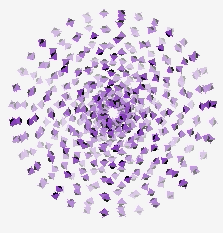

# turtle graphics with playback

Inspired by [turtle module in Python](ttps://docs.python.org/3/library/turtle.html)

## Usage

```sh
# generate script
python3 gen.py

# execute script
cargo run --release script
```

## Gallery

Python's turtle: 





